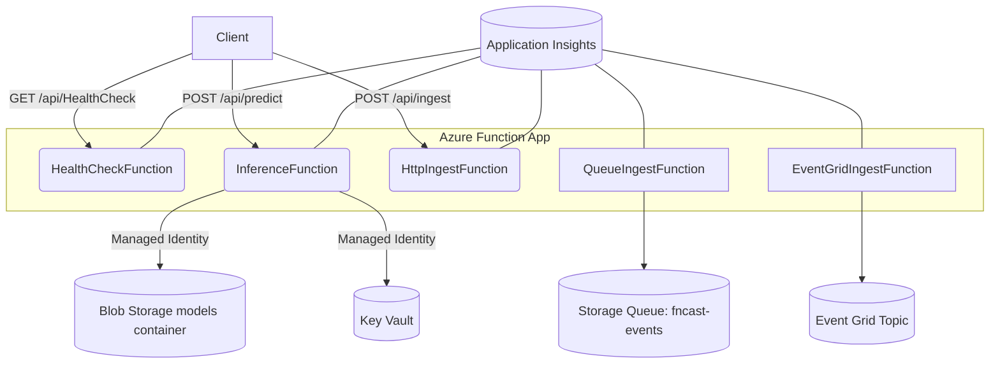

```mermaid
flowchart TD
    A[Client] -->|GET /api/HealthCheck| B(HealthCheckFunction)
    A -->|POST /api/predict| C(InferenceFunction)
    A -->|POST /api/ingest| D(HttpIngestFunction)

    subgraph Azure Function App
        B
        C
        D
        E[QueueIngestFunction]
        F[EventGridIngestFunction]
    end

    C -->|Managed Identity| G[(Blob Storage models container)]
    C -->|Managed Identity| H[(Key Vault)]
    E --> I[(Storage Queue: fncast-events)]
    F --> J[(Event Grid Topic)]

    AzureInsights[(Application Insights)] --- B
    AzureInsights --- C
    AzureInsights --- D
    AzureInsights --- E
    AzureInsights --- F
```
